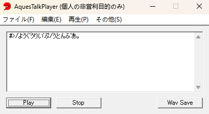

# 油库里普通话

## 各模块功能详解


## 目录

- [文字转换](#文字转换)
- [拼音转换](#拼音转换)
- [拼音数据库管理](#拼音数据库管理)


## 文字转换

### 基础用法

文字转换功能将中文句子转换为“伪日本语”。示例：

```python
import yukkurimandarin as ym

result = ym.text_convert("油库里普通话。")
print(result)
```

此代码的输出将类似于

```
/ようく'うりい'ぷ/うとんふ'あ。
```

复制输出的内容，将其粘贴到支持[音声记号](https://github.com/wubzbz/Yukkuri-Mandarin/blob/main/docs/phonology.md/#什么是音声记号)的油库里语音生成器中，即可生成中文油库里语音。

#### 一、（推荐）在[油库里MovieMaker](https://manjubox.net/ymm4/)中使用


#### 二、在[AquesTalkPlayer](https://www.a-quest.com/products/aquestalkplayer.html)中使用

在AquesTalkPlayer中使用音声记号标记的文本时，需要在其开头加上`#>`。要实现这一点非常简单，只需要稍微修改一下你的代码：

```python
import yukkurimandarin as ym

result = ym.text_convert("油库里普通话。")
print(f"#>{result}") # 使用f-字符串为伪日本语的开头添加#>
```

接着，将生成的“伪日本语”粘贴到文本框中，点击Play即可播放。如下图所示：



#### 三、注意事项

- 如果您使用上述语音生成软件以外的生成工具，请确认其是否支持音声记号。如果不支持，可以设置`text_convert`的参数`without_accent`为`True`，以获得不含音声记号的结果。如果您使用的语音生成工具对音声记号的定义与本项目采用的不一致，您可以选择[自建拼音数据库](https://github.com/wubzbz/Yukkuri-Mandarin/blob/main/docs/database-mngr.md)。

### 高级用法


## 拼音转换

拼音转换允许将以空格分开的拼音序列转换为“伪日本语”。

使用拼音转换函数

## 拼音数据库管理